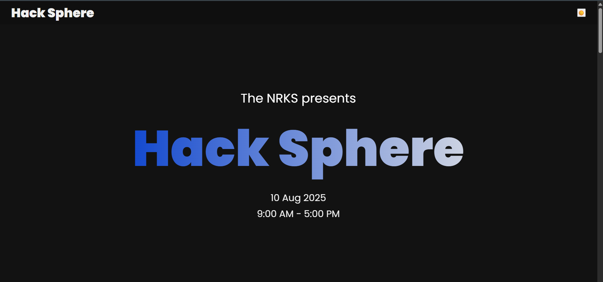
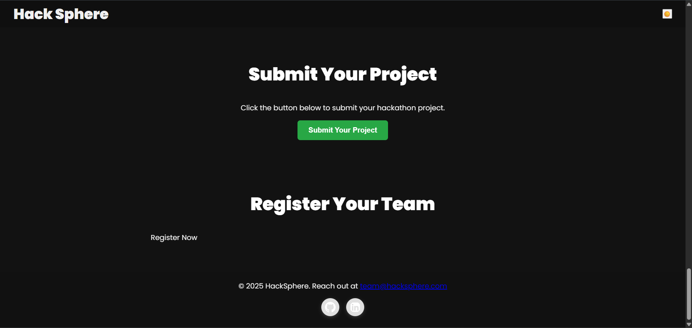
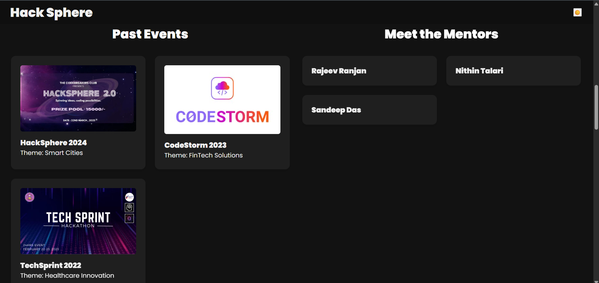

# 🚀 HackSphere - Hackathon Platform

HackSphere is a dynamic hackathon management web app built using **React.js**. It allows users to explore hackathon details, view timelines, register teams, submit projects, and interact with mentors & judges. The platform supports both **light and dark modes**, and includes smooth UI animations and a particle background.

---

## 📸 Screenshots

### 🏠 Home Page

### 💡 Problem Statements & Timeline

### 📋 Register Your Team

### 🧑‍⚖️ Mentors & Judges

### ❓ FAQs Section

> 🔦 Dark mode is supported across all pages.

---

## 🛠️ Features

- 🌗 Light/Dark mode toggle
- 🎆 Particle background animation
- 📜 Scroll animations using AOS
- 🔒 Team registration with pop-up forms
- 🚀 Project submission with validation
- 👨‍🏫 Mentor and Judge profiles with images & bios
- 📅 Timeline and Past Events section
- ❓ FAQ section for participants
- 📱 Fully responsive design

---

## 📂 Folder Structure

hacksphere/
├── public/
│ └── index.html
├── src/
│ ├── assets/
│ ├── components/
│ ├── pages/
│ ├── data/
│ ├── App.js
│ └── styles/
│ └── global.css
├── README.md
└── package.json

---

## 🧪 Technologies Used

- ⚛️ React.js
- 🎨 CSS3
- 🧩 AOS (Animate on Scroll)
- 🌓 Dark Mode (Custom Theme Switch)
- 🎆 tsParticles
- 🔗 React Router DOM

---

## 🧑‍💻 Getting Started
Install dependencies
npm install
Run the development server
npm start

📤 Deployment

Netlify

📎 Links
🔗 Live Demo: https://nrkshacksphere.netlify.app/

💼 LinkedIn: https://www.linkedin.com/in/nithin-talari-416569268/

🐙 GitHub Repo: https://github.com/NithinTalari/hacksphere

🙏 Acknowledgements
Thanks to Rajeev Ranjan and the entire team for the guidance and opportunity.

📄 License
This project is open source and available under the MIT License.

hacksphere/
├── screenshots/
│ ├── home.png
│ ├── problems-timeline.png
│ ├── register.png
│ ├── mentors.png
│ ├── submit.png
│ └── faqs.png

